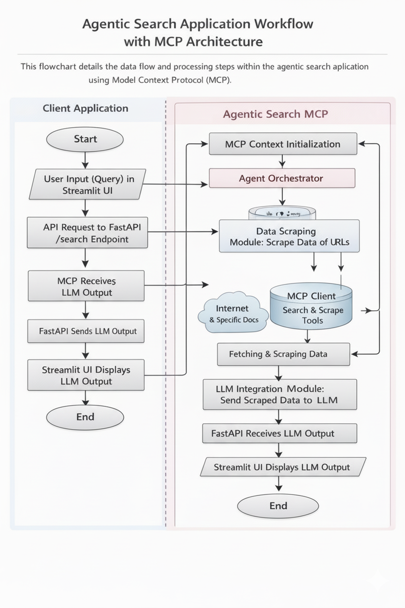

# agentic-search-mcp

Agentic search application using MCP (Model Context Protocol) with a Streamlit-based UI, data scraping, and LLM integration.

## Table of Contents

- [Introduction](#introduction)
- [Features](#features)
- [Architecture](#architecture)
- [Repository Structure](#repository-structure)
- [Installation](#installation)
- [Configuration](#configuration)
- [Usage](#usage)
- [API Endpoints](#api-endpoints)
- [Contributing](#contributing)
- [License](#license)

## Introduction

This project implements an agentic search application leveraging the Model Context Protocol (MCP). It features a Streamlit-based user interface, automated data scraping from specified URLs, integration with Large Language Models (LLMs) for intelligent analysis, and a FastAPI backend for API integrations.

## Features

-   **Agentic Search:** Utilizes intelligent agents to perform search tasks.
-   **Model Context Protocol (MCP):** Employs MCP for managing context within the agent.
-   **Streamlit UI:** Offers a user-friendly interface built with Streamlit.
-   **Automated Data Scraping:** Scrapes data from specified URLs to provide context for the LLM.
-   **LLM Integration:** Integrates with Large Language Models (LLMs) for intelligent data analysis and output generation.
-   **FastAPI Backend:** Provides API endpoints for seamless integration and data retrieval.

## Architecture

The application follows a modular architecture:

1.  **Streamlit UI (front/):** The user interface built with Streamlit allows users to initiate searches and view results.
2.  **FastAPI Backend (api/):** The FastAPI backend handles API requests, orchestrates data scraping, and interacts with the LLM.
3.  **MCP Client:** Manages the Model Context Protocol, ensuring proper context flow between components.
4.  **Data Scraping Module:** Scrapes data from specified URLs based on user queries.
5.  **LLM Integration Module:** Sends scraped data to the LLM for analysis and generates the final output.

## End-to-End Request Flow



## Repository Structure

```
agentic-search-mcp/
├── .env
├── .gitignore
├── .ipynb_checkpoints/
├── .python-version
├── LICENSE
├── README.md
├── api/
│   ├── __init__.py
│   ├── main.py
│   └── ...
├── front/
│   ├── __init__.py
│   ├── main.py
│   └── ...
├── main.py
├── pyproject.toml
└── uv.lock
```

## Installation

1.  Clone the repository:

    ```bash
    git clone https://github.com/hargurjeet/agentic-search-mcp.git
    cd agentic-search-mcp
    ```

2.  Set up the environment using `uv`:

    ```bash
    python3 -m venv .venv
    source .venv/bin/activate
    python3 -m pip install uv
    uv pip install -r requirements.txt
    ```

    *Note: Ensure you have Python 3.8+ installed.*

## Configuration

1.  Create a `.env` file in the root directory and add the following environment variables:

    ```
    OPENAI_API_KEY=your_openai_api_key
    SCRAPE_URLS=url1,url2,url3 # Comma-separated list of URLs to scrape
    ```

    *Replace `your_openai_api_key` with your actual OpenAI API key and `url1,url2,url3` with the URLs you want to scrape.*

2.  Configure the `api/main.py` file to adjust data scraping parameters and LLM settings as needed.

## Usage

1.  Start the FastAPI backend:

    ```bash
    cd api
    uvicorn main:app --reload
    ```

    *This will start the FastAPI server, typically on `http://localhost:8000`.*

2.  Run the Streamlit application:

    ```bash
    cd ../front
    streamlit run main.py
    ```

3.  Open your browser and navigate to the address provided by Streamlit (usually `http://localhost:8501`).

4.  Interact with the agentic search application through the Streamlit UI. Enter your query, and the application will:

    -   Scrape data from the configured URLs.
    -   Send the scraped data to the LLM for analysis.
    -   Display the LLM's output in the Streamlit UI.

## API Endpoints

The FastAPI backend provides the following API endpoints:

| Method | Endpoint          | Description                                                    |
| :----- | :---------------- | :------------------------------------------------------------- |
| POST   | `/search`         | Initiates the agentic search process.  Takes a `query` parameter in the request body. |
| GET    | `/health`         | Returns the health status of the API.                          |

Example `POST /search` request:

```json
{
  "query": "What are the latest news about AI?"
}
```

## Contributing

Contributions are welcome! Here's how you can contribute:

1.  Fork the repository.
2.  Create a new branch for your feature or bug fix.
3.  Make your changes and commit them with clear, descriptive messages.
4.  Submit a pull request.

Please ensure your code adheres to the project's coding standards.

## License

This project is licensed under the Apache License 2.0 - see the [LICENSE](LICENSE) file for details.
